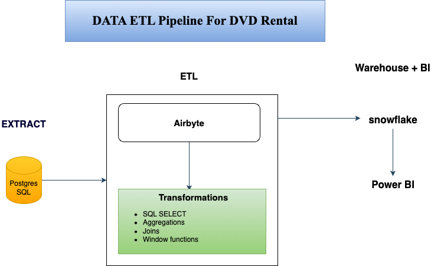

# Big Data ETL Project – DVD Rental

## Project Overview
This project demonstrates a modern end-to-end ETL pipeline using Airbyte, Snowflake, DBT-style SQL transformations, and Power BI dashboards. The dataset used is the classic [DVD Rental PostgreSQL sample](https://www.postgresqltutorial.com/postgresql-sample-database/).

## Tools & Stack
- **Airbyte** – Data ingestion from PostgreSQL to Snowflake
- **Snowflake** – Cloud data warehouse for storing + transforming data
- **SQL** – Used for DBT-style transformations (joins, aggregations, etc.)
- **Power BI** – Dashboard visualizations
- **GitHub** – Version control + documentation

---

## How It Works

### 1. Extract & Load with Airbyte
- **Source**: PostgreSQL DVD Rental DB (via Docker)
- **Destination**: Snowflake cloud warehouse
- Used `Full Refresh → Overwrite` sync mode

Screenshots in `/docs/airbyte_screenshots/`

---

### 2. Transform in Snowflake (SQL)
Used SQL to create dimensional model:
- **Fact Table**: `fact_rentals`
- **Dimensions**: `dim_customer`, `dim_film`, `dim_date`

Applied 8+ techniques:
- Aggregation (`SUM`, `AVG`, `COUNT`)
- Filtering (`WHERE`, `HAVING`)
- Joins
- Window functions
- Casting
- Renaming
- Sorting
- Grouping

See `/transformations/` folder

---

### 3. Validate with Data Quality Checks
Wrote SQL tests to validate:
- No NULL primary keys
- Valid foreign keys
- No negative payment amounts
- Unique customer IDs
- Row counts match expectations

See `/tests/`

---

### 4. Visualize in Power BI
Created dashboards for:
- Revenue per customer
- Rentals over time
- Genre distribution

See `/dashboards/powerbi_screenshots/`

---

## ER Diagram

---

## Folder Guide

| Folder            | Description                        |
|-------------------|------------------------------------|
| `data_integration/` | Airbyte config & connection summary |
| `transformations/`  | SQL files for transforming data     |
| `dashboards/`       | Screenshots of Power BI visuals     |
| `docs/`             | Diagrams & Airbyte screenshots      |
| `tests/`            | SQL tests for data quality          |

---

## Key Learnings
- Building real-world ETL pipelines with modern tools
- Transforming raw data into dimensional models
- Using Airbyte, Postgresql, docker, Snowflake, BI tools end-to-end